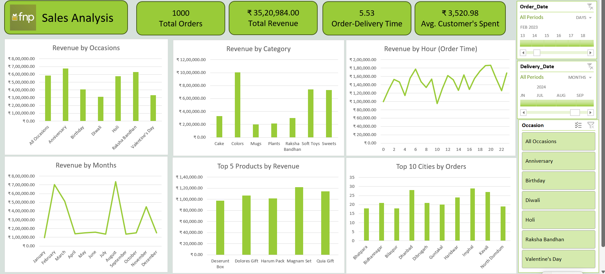

# 📊 Ferns and Petals (FNP) Sales Analysis — End-to-End Excel Project

---

## 📌 Project Summary

This repository showcases an **end-to-end retail data analysis project** completed fully in **Microsoft Excel** for **Ferns and Petals (FNP)** — a popular gifting company delivering flowers, cakes, and personalized gifts for occasions like Birthdays, Anniversaries, Diwali, Raksha Bandhan, Holi, and Valentine’s Day.

The goal of this project is to analyze historical sales data to uncover actionable insights that help the company improve sales performance, optimize delivery timelines, and enhance customer satisfaction.

---

## 🗂️ Data Details

- **Source:** Self-collected retail sales data.
- **Structure:** 3 interconnected tables:
  - **Orders Table:** Order IDs, Order Dates, Delivery Dates.
  - **Products Table:** Product Categories, Occasion Types, Product Revenue.
  - **Customers Table:** Customer Locations, Order Quantities, Spending Details.

---

## ✅ What I Did

**All analysis was done 100% in MS Excel:**

- **Data Cleaning:**  
  - Removed duplicates, fixed inconsistent date formats, handled missing values.
- **Data Exploration:**  
  - Explored sales trends by month, occasion, and product category.
- **Data Analysis:**  
  - Built pivot tables and custom calculations for revenue, order-delivery durations, and customer spend.
- **Data Visualization:**  
  - Created an interactive Excel dashboard using charts, slicers, and summary tables.

---

## 🔑 Business Insights Generated

Key questions answered through this project:

1. **Total Revenue:** Overall revenue earned during the period.
2. **Avg. Order & Delivery Time:** Average days taken to deliver orders.
3. **Monthly Sales Trends:** How sales fluctuate month-to-month.
4. **Top Products by Revenue:** Best-selling products by revenue.
5. **Customer Spending:** Average spend per customer.
6. **Top 5 Product Performance:** Sales trend for the top 5 products.
7. **Top 10 Cities:** Cities with the highest number of orders.
8. **Order Quantity vs Delivery Time:** Impact of large orders on delivery speed.
9. **Revenue by Occasion:** Revenue comparison across different occasions.
10. **Product Popularity by Occasion:** Which products are most popular for which events.

---

## 📊 Final Deliverables

- **Excel File:** Contains all raw data, cleaned tables, pivot tables, and the final dashboard.
- **Dashboard Snapshot:** Included as `Dashboard.png` for a quick visual reference.

---

## 🛠️ Tools & Techniques Used

- **MS Excel**
  - Data Cleaning
  - Formulas & Functions
  - Pivot Tables
  - Charts (Bar, Line, Pie)
  - Dashboard Design with Slicers

---
